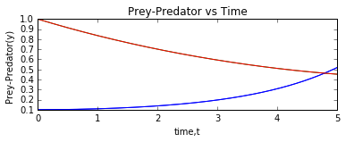

UECM3033 Assignment #3 Report
========================================================

- Prepared by: **Jamie Lee Mei Mei**
- Tutorial Group: T2/T3

--------------------------------------------------------

## Task 1 --  Gauss-Legendre formula

The reports, codes and supporting documents are to be uploaded to Github at: 

https://github.com/JamieLeeMM/UECM3033_assign3.git

**Explain how you implement your `task1.py` here.**

First, we have defined the gauss lengendre with 20 nodes using the function "def gausslegendre(f, a, b, n=20)" 

The function of x here is defined as "(x**2 +7*x)/(1 +np.sqrt(x))**4". 
 The range of integration needed is between 0 to 1. However, the built in range of Gauss Legendre function in python is -1 and 1. We also used "X, w = np.polynomial.legendre.leggauss(n)" function to get the built in weight(w) and nodes (X).
 

So, we extend to a more general interval [a,b] by change of variable "x=(a+b)/2+(b-a)/2*X". With this, we get the new x as followed. 

array([ 0.0034357 ,  0.01801404,  0.04388279,  0.08044151,  0.12683405,
        0.18197316,  0.2445665 ,  0.31314696,  0.38610707,  0.46173674,
        0.53826326,  0.61389293,  0.68685304,  0.7554335 ,  0.81802684,
        0.87316595,  0.91955849,  0.95611721,  0.98198596,  0.9965643 ])

Using this new x, we can find the f(x). 

array([ 0.01915907,  0.0763909 ,  0.14444696,  0.20979338,  0.26724978,
        0.31554608,  0.35512651,  0.3870836 ,  0.41265709,  0.43301383,
        0.44916514,  0.46194906,  0.47204116,  0.47997587,  0.48616972,
        0.4909429 ,  0.4945375 ,  0.49713218,  0.49885352,  0.49978453])

then we use the new f(x) to multiply with the weighting coefficient. then we sum all the multiplication of f(x) and weighting coeffition together and lastly we also multiply with (b-a)/2 to get the final solution.
With this, the answer we obtained from my_integral is similar to gausslegendre((f,0,1)) which is  0.40033809741102566.

**Explain how you get the weights and nodes used in the Gauss-Legendre quadrature.**

"X, w = np.polynomial.legendre.leggauss(n)"
X is the node while W is the weight. However the nodes is for range -1 to 1. so we changed the range into (a,b) by changing the variable "x=(a+b)/2+(b-a)/2*X". The weight is left unchanged.

---------------------------------------------------------

## Task 2 -- Predator-prey model

Explain how you implement your `task2.py` here, especially how to use `odeint`.

First we defind a function of dy/dt that updates and return the new y0 and y1 to y. First we initialise constant [a,b] to [1.0,0.2] and we define the function "[a*(y[0]-y[0]*y[1]),b*(-y[1]+y[0]*y[1])]". Then we set y as [0.1,1.0] and calculate the ODE from 1 year to 5th year with 200 steps in between. 

Put your graphs here and explain.

The first graph is the Prey- Predator vs time graph.The blue line is the population of Prey against time while the red line is the population of Predator against time. The predator started off at very high population while the prey started off at very low population. The low population of prey is not enough for the survival of the predator and hence the population of predator decreases. As time passes by, the predator dropped drastically while the prey started to rise. This situation clearly shows that the populatoin of prey and predator are inversely related. 

In the second graph, (Predator vs Prey), again we can concude that as the predator population decreases, the prey population rises. 

These are the graphs plotted when the initial condition y is changed from [0.1,1.0] to [0.11,1.0]. the pattern of the graphs are still similar to the the initial graphs.

Is the system of ODE sensitive to initial condition? Explain.

NO. The graphs plotted with y=[0.1,1.0] is quite similar to y=[0.11,1.0]. This is because the two graphs on Prey- Predator Vs Time cross each other around 0.5 at time 4.5.

-----------------------------------

last modified: 16 April 2016 
